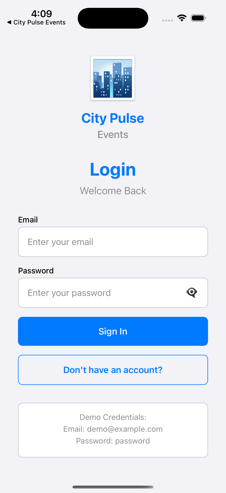
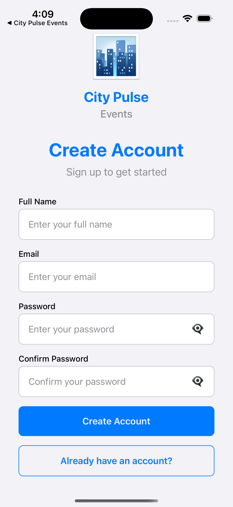
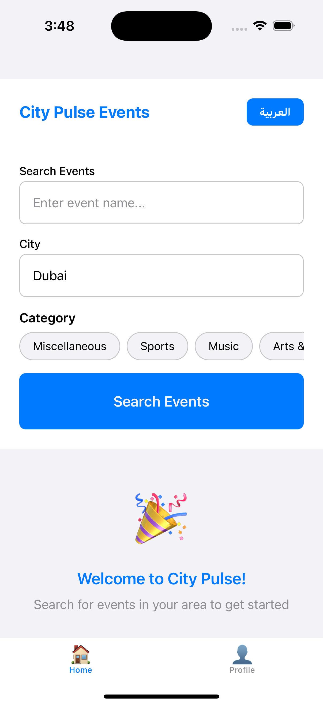
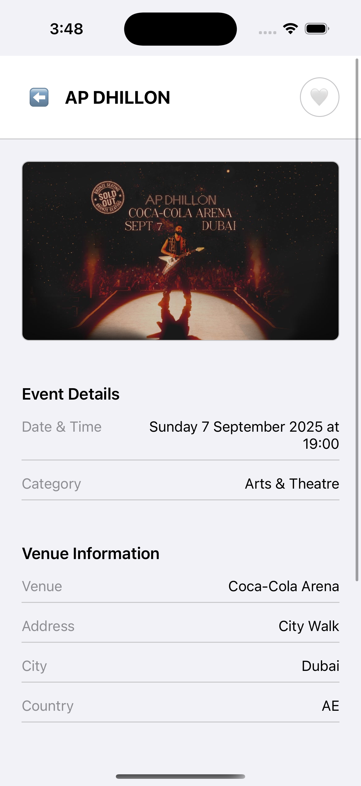
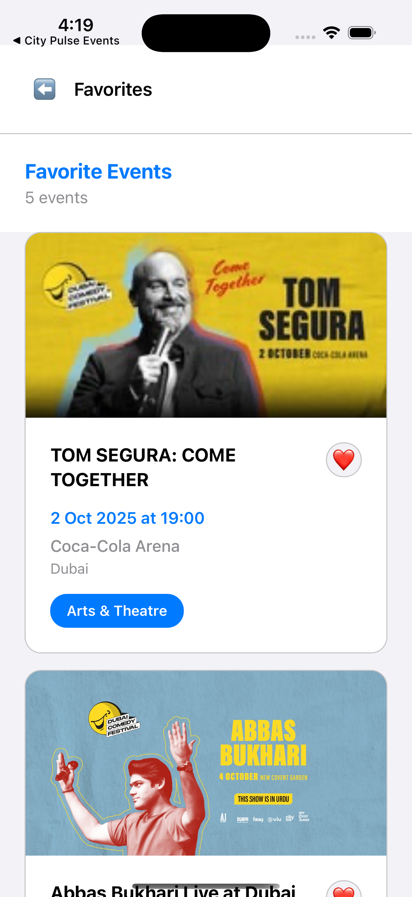

# City Pulse Events - Local Events Explorer

A React Native mobile application for discovering and exploring local events using the Ticketmaster Discovery API.

## 🚀 Features

### Core Requirements ✅
- **Home Screen**: Search for events by keyword and city using public API
- **Event Details**: View comprehensive event information
- **Favorites**: Mark and manage favorite events with local storage
- **Bilingual Support**: Toggle between English and Arabic (RTL layout ready)
- **Navigation**: Complete navigation flow (Splash → Home → Event Details → Profile)
- **User Profile**: Display user information and settings
- **Local Storage**: Persistent data storage using AsyncStorage

### Bonus Features 🌟
- **Map Preview**: Location coordinates display in event details
- **Mock Authentication**: Login/Signup system with demo credentials
- **Modern UI**: Clean, responsive design with proper loading states
- **Error Handling**: Comprehensive error boundaries and user feedback

## 🛠️ Tech Stack

- **Framework**: React Native with Expo
- **Language**: TypeScript
- **State Management**: React Context + useReducer
- **API Management**: React Query (TanStack Query)
- **Navigation**: React Navigation v6
- **Storage**: AsyncStorage for local data persistence
- **API**: Ticketmaster Discovery API
- **Styling**: React Native StyleSheet

## 📱 Screenshots

### App Screenshots
*Add your screenshots here by placing them in the `screenshots/` folder and updating the paths below:*

#### Authentication Flow

*Login screen with app branding and password toggle*


*Sign up screen with form validation*

#### Main App Features

*Home screen with event search and categories*


*Event details with venue information and map preview*


*User profile with language toggle and favorites*


*Favorites screen showing saved events*

### How to Add Screenshots
1. **Take screenshots** of your app running on simulator/device
2. **Save them** in the `screenshots/` folder
3. **Update the paths** in this README to match your screenshot filenames
4. **Commit and push** the screenshots with your code

**Recommended screenshot sizes:**
- iOS Simulator: 390x844 (iPhone 14)
- Android Emulator: 360x800 (Pixel 4)
- Format: PNG or JPG
- Quality: High resolution for professional appearance

## 🚀 Getting Started

### Prerequisites
- Node.js (v16 or higher)
- Yarn package manager
- Expo CLI
- iOS Simulator or Android Emulator (or physical device)

### Installation

1. **Clone the repository**
   ```bash
   git clone https://github.com/IbrahimSalem0/city-pulse-events.git
   cd city-pulse-events
   ```

2. **Install dependencies**
   ```bash
   yarn install
   ```

3. **Development Mode (Recommended)**
   ```bash
   # Start the development server
   yarn start
   
   # Run on iOS simulator (development build)
   npx expo run:ios
   
   # Run on Android emulator (development build)
   npx expo run:android
   ```

4. **Expo Go (Quick Testing)**
   ```bash
   # Start the development server
   yarn start
   
   # Press 'i' for iOS simulator
   # Press 'a' for Android emulator
   # Scan QR code with Expo Go app on physical device
   ```

**Note**: For development mode with native code access, use `npx expo run:ios` or `npx expo run:android`. For quick testing without native code, use Expo Go with `yarn start`.

## 🔑 Demo Credentials

For testing the app, use these demo credentials:
- **Email**: `demo@example.com`
- **Password**: `password`

## 🏗️ Project Structure

```
src/
├── components/          # Reusable UI components
├── screens/            # Screen components
│   ├── SplashScreen.tsx
│   ├── LoginScreen.tsx
│   ├── SignUpScreen.tsx
│   ├── HomeScreen.tsx
│   ├── ProfileScreen.tsx
│   └── EventDetailsScreen.tsx
├── navigation/         # Navigation configuration
│   ├── AppNavigator.tsx
│   └── types.ts
├── services/           # API and storage services
│   ├── api.ts
│   └── storage.ts
├── hooks/             # Custom hooks
│   └── useEvents.ts
├── store/             # State management
│   └── AppContext.tsx
├── types/             # TypeScript interfaces
│   └── index.ts
├── constants/         # App constants
│   └── index.ts
└── assets/            # Images, fonts, etc.
```

## 🔧 Configuration

### API Keys
The app uses the Ticketmaster Discovery API. API keys are already configured in the constants file.

### Environment Variables
No additional environment variables are required for basic functionality.

## 📱 Features in Detail

### Event Search
- Search by keyword (event name, description)
- Filter by city
- Category-based filtering
- Real-time API integration

### User Management
- Mock authentication system
- User profile management
- Language preferences
- Favorite events tracking

### Localization
- English and Arabic support
- RTL layout ready
- Persistent language preference

### Data Persistence
- User preferences
- Favorite events
- Language settings
- Authentication state

## 🚀 Deployment

### Development Builds
```bash
# Build and run on iOS simulator
npx expo run:ios

# Build and run on Android emulator
npx expo run:android
```

### Building for Production
```bash
# Build for iOS
npx expo build:ios

# Build for Android
npx expo build:android

# Build for web
yarn web
```

### Expo Build (Legacy)
```bash
expo build:ios
expo build:android
```

## 🤝 Contributing

1. Fork the repository
2. Create a feature branch (`git checkout -b feature/amazing-feature`)
3. Commit your changes (`git commit -m 'Add some amazing feature'`)
4. Push to the branch (`git push origin feature/amazing-feature`)
5. Open a Pull Request

## 📄 License

This project is licensed under the MIT License - see the [LICENSE](LICENSE) file for details.

## 🙏 Acknowledgments

- Ticketmaster for providing the Discovery API
- Expo team for the excellent development platform
- React Native community for continuous support

## 📞 Support

For support or questions, please open an issue in the GitHub repository or contact the development team.

---

**Note**: This is an interview task project demonstrating senior mobile development skills including clean architecture, state management, API integration, and user experience design.
